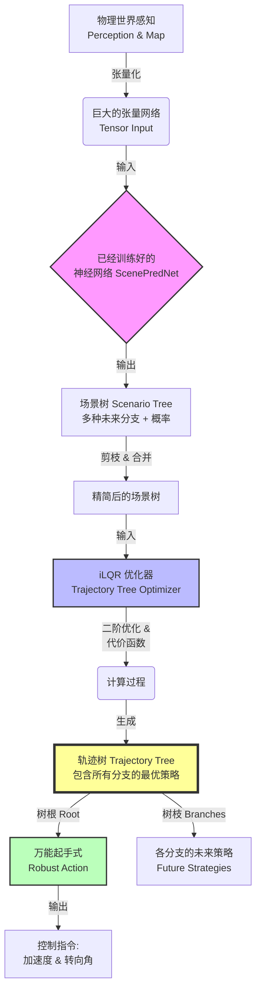

# MIND 系统数据流

---

##  综述：MIND 是怎么工作的

1.  **编织大网 (Input)**：首先，我们把观察层（传感器、地图）得到的所有数据（在这里我们所做的只是决策的算法，没有设置观察层数据的获取，demo中所有的观察层的数据都是设计好了的，并且全部都是理想化的数据，也就是假设在真正应用的时候，观察层的数据已经完美获取好了）编织成一个巨大的张量网络 (Tensor)。
2.  **预测未来 (Prediction)**：把它输进一个**已经训练好**（离线训练）的神经网络 (ScenePredNet)。网络会“算命”，输出**场景树**：包含多种可能的未来分支，以及每种分支发生的概率。
3.  **剪枝与合并 (Pruning)**：对这些分支进行处理，把概率太低的减掉，把太相似的场景合并，只留下几个最重要、概率最大的分支。
4.  **决策求解 (optimization)**：接着，**iLQR 算法 (二阶方法)** 介入。它根据定义好的**代价函数 (Cost Function)**，进行运算，生成一棵包含所有最优策略的 **“轨迹树” (Trajectory Tree)**。在此过程中，它**同时**做两件事：
    *   为每一个保留下来的未来分支，推演该场景下的后续发展（树枝）。**注意：由于这里强制要求所有分支必须共享同一个“起步动作”，所以算出来的策略往往是全局妥协后的结果，在单个场景看来可能并非极致完美（比如为了防备有人插队，在没人插队的那个分支里显得稍微保守了一点），但它是综合来看最合理的。**
    *   寻找一个**当前时刻的“万能起手式”**（树根，我把它称之为稳一手，也就是在所有可能的场景里求稳）。
5.  **最终输出 (Control)**：这个“万能起手式”必须能兼容所有分支（即加权后的总损失最小）。系统从中提取最后两个数值——**加速度 (Accel)** 和 **转向角 (Steering Angle)**，发送给底盘执行。

### 核心流程图 (Flowchart)

---

## 总体流程图 

**数据流向**：`Raw Data` -> `Tensorization` -> `Network Inference` -> `Scenario Tree` -> `Trajectory Tree (iLQR)` -> `Control`

---

## 阶段一：输入与预处理 (Input & Preprocessing)

### 1. 原始输入 (Raw Input)
我们将物理世界的数据“打包”成计算机能听懂的格式。
*   **地图 (Map)**: 这是一个**矢量包**。它不包含像素（不是照片），而是包含一堆数学线条。比如车道中心线（作为引导线）、车道左右边界（作为碰不得的墙）、人行道多边形。
*   **物体 (Objects)**: 周围所有会动的东西（车辆、行人等）。

*   **Q1: 到底传进去了什么？**
    *   是的，就是把物理世界“打包”了。所有的观察层的数据都是设计好了的，并且全部都是理想化的数据。
*   **Q2: 为什么需要过去的历史轨迹？为什么前几秒没预测？（4个demo视频里前7秒没有预测）**
    *   **区别**: 地图是**静**的（路不会跑），感知是**动**的（人会跑）。
    *   **历史轨迹的作用**: 为了**推断意图**。只看一张照片（当前一帧），你不知道那辆车是在加速还是在等红灯。看它过去 7 秒的动作（比如正在向左偏），网络才能猜出它“想左转”。
    *   **关于视频空白**: 正是因为算法启动时需要先**攒够**一段历史数据（比如几十帧）来填满它的“记忆缓存”，然后才敢开始预测。这就是前面几秒“沉默”的原因。

### 2. 张量化 (Tensorization)
为了让神经网络能处理这些几何数据，我们需要进行标准化处理。
*   **流程**: 物理世界(米/秒) -> 减去中心点 -> 旋转 -> 张量(Matrix) -> 喂给网络。
*   **标准化**: 我们强制把**目标车道的终点**设为 $(0,0)$，并且把车头朝向转正。

*   **Q3: 为什么要旋转坐标系？**
    *   **去绝对化**: 神经网络不认识“经纬度”。如果你在上海训练，车在(x=3000, y=5000)，换到北京车在(x=100, y=200)，网络就傻了。
    *   **目的**: 无论你在地球哪里，网络看到的都是“车在路中间，目标在正前方”。这叫**归一化 (Normalization)**，是为了让网络能通用。

---

## 阶段二：神经推理 (Neural Inference)

### 3. ScenePredNet (场景预测网络)
这是系统的“直觉大脑”，负责预测未来。它通过离线训练（梯度下降）学会了看路况。

*   **Q4: 为什么要算“交互注意力”？**
    *   **情景**: 左边的车想变道，它会看你眼色；你想加速，也得看前车眼色。这叫**交互**。
    *   **Attention 机制**: 就像人的注意力。网络计算车辆 A 和车辆 B 的关系矩阵。如果关系强（比如距离近、速度快），网络就会给它们分配更多的“关注度”，预测时就会在这个因素上加权。
*   **Q5: 输出的是什么？怎么预测的？**
    *   是的，输出分两头：
        *   **分类头 (大脑直觉)**: “这辆车 70% 概率左转，30% 直行”。这是通过 Softmax 函数算出来的概率分布。
        *   **回归头 (精准想象)**: “如果左转，它的轨迹是 $(x_1, y_1), (x_2, y_2)...$”。这是通过回归拟合算出来的具体坐标点。
    *   **总结**: 网络一次性给出了**6种平行宇宙**的剧本（去哪？概率多少？）和细节（怎么走？轨迹线在哪？）。

---

## 阶段三：场景树构建 (Scenario Tree Construction)

### 4. AIME 算法 (分支生成)
拿到神经网络的预测后，我们构建一棵代表未来的树。
*   **步骤 A: 批处理预测**。一次性预测所有叶子节点的未来。
*   **步骤 B: 剪枝 (Pruning)**。如果某分支概率过低（如 $P < 0.001$），直接丢弃。
*   **步骤 C: 合并 (Merging)**。如果两条预测轨迹太像了，就合并成一条。
*   **结果**: 生成一棵深度为 $H$ 的树，包含 $K$ 个叶子节点。

---

## 阶段四：代价树构建 (Cost Tree Construction)

### 5. 代价函数设计 (Cost Function)
现在我们有了“预测的平行宇宙”，要把它们变成“可计算的代价”。iLQR 的任务就是找到让总代价最小的开法。

*   **Q6: 代价树到底是个啥？为什么要加起来？**
    *   **现实含义**: 它是给司机打分的“考官”。
    *   **打分项**:
        *   $a^2$ (加速度): 为啥我有这个？因为**急刹车/急加速是不舒服的**。代价越大，代表越颠簸。
        *   $\delta^2$ (转向角): 乱打方向盘是不安全的。
        *   $(v - v_{target})^2$: 开太慢会被滴滴，开太快超速。我们要尽量**接近**目标速度。
        *   $d_{lane}^2$: 压线扣分。
    *   **原理**: 我们把这些“不舒服、不安全、不快”全部量化成数字（Cost），加在一起就是**总痛苦值**。

---

## 阶段五：优化求解 (iLQR Optimization)

### 6. iLQR 通俗理解 (Intuition)
这是系统的“逻辑大脑”，负责实时决策。它使用二阶优化方法。他根据前面已经预测出来的不同概率的不同场景，引入加速度，转向速度，加加速度，转向角速度等参数，进行优化。

**核心产物**：优化的结果首先是生成一棵完整的 **“轨迹树” (Trajectory Tree)**。这棵树的每一个分支都代表了在特定场景下的最佳行驶轨迹。这个过程就是寻找到综合情况下代价函数最低的那棵树。

*   **Q7: 完全没看懂这个优化？是让弹珠一点点滚下去吗？**
    *   **不，那是一阶方法（梯度下降）。iLQR 是更高级的“跳跃”。**
    *   **一阶方法（盲人下山）**：盲人只感到脚下的坡度（一阶导），只能小心翼翼地顺着坡**滚**下去。虽稳但慢。
    *   **二阶方法 iLQR（物理学家下山）**：物理学家能看到地势的弯曲（二阶导/曲率）。他拟合出一个“碗”的形状，直接算出碗底在哪，然后**一步跳**过去。
*   **Q9: 为什么神经网络不用 iLQR？**
    *   **参数量**: iLQR 适合参数少（几十个）的控制问题，即使算二阶矩阵也很快。神经网络有上亿参数，算二阶矩阵（Hessian）会内存爆炸。
    *   **平滑度**: 物理世界的运动是很光滑的（像碗），适合二阶拟合。神经网络的Loss太复杂，坑坑洼洼。

---

## 阶段六：控制输出 (Control Output)

### 7. 最终的“稳一手” (Robust Control)
系统会算出一个能够兼顾所有未来分支的“万能起手式”。在前面的 iLQR 优化中，其实已经把所有分支的代价加起来了，生成了包含所有策略的 **轨迹树**。所以输出的其实就是 **这棵轨迹树的“树根”** —— 那个综合了所有分支代价最低的起始动作。

**注意：虽然 iLQR 优化的变量是“加加速度”和“转向角速度”（控制量 $u$），但为了方便底盘执行，代码最终提取的是优化后的“加速度”和“转向角”（状态量 $x$）发送给车辆。**

*   **Q8: 在中间过程中，算法根据不同场景计算出了不同场景当中的应对策略，但这个应对策略并不一定是该场景下的最优解，而是可以使最终解最优的那个动作，轨迹树当中的决策是副产品，我们最终要的是调和后的，在所有决策当中折中的那个动作**
    *   **是的，计算结果是一棵树**：包含了面对 A 情况怎么走，面对 B 情况怎么走。
    *   **但是，调和发生在“树根”**：
        *   iLQR 强制要求：**不管未来有多少个分支，所有分支在 T=0 时刻（现在）必须共用同一个控制量 $u_0$。**
        *   **怎么调和的？** 算法在优化的过程中，自动寻找那个让（场景A的损失 + 场景B的损失）总和最小的那个动作。
        *   **结果**: 这个动作往往是妥协的结果（比如备刹车），虽然在单个场景里不是最爽的，但是它是最稳的。
    *   **结论**: 输出的是**一个**动作（树根），系统的物理输出是**加速度 (Accel)** 和 **转向角 (Steering Angle)**。

---

## 总结

这个系统的数据流是一个**“从模糊到精确”**的过程：
1.  **神经网络**负责在模糊的未来中划出大概的范围 (Proposal)。
2.  **iLQR**负责在这个范围内用精确的数学剪刀裁剪出最优的路径 (Refinement)。

**整个项目的流程和原理就都在这里了，具体是如何实现的要去代码库里看，如果有什么错误欢迎提出来**
