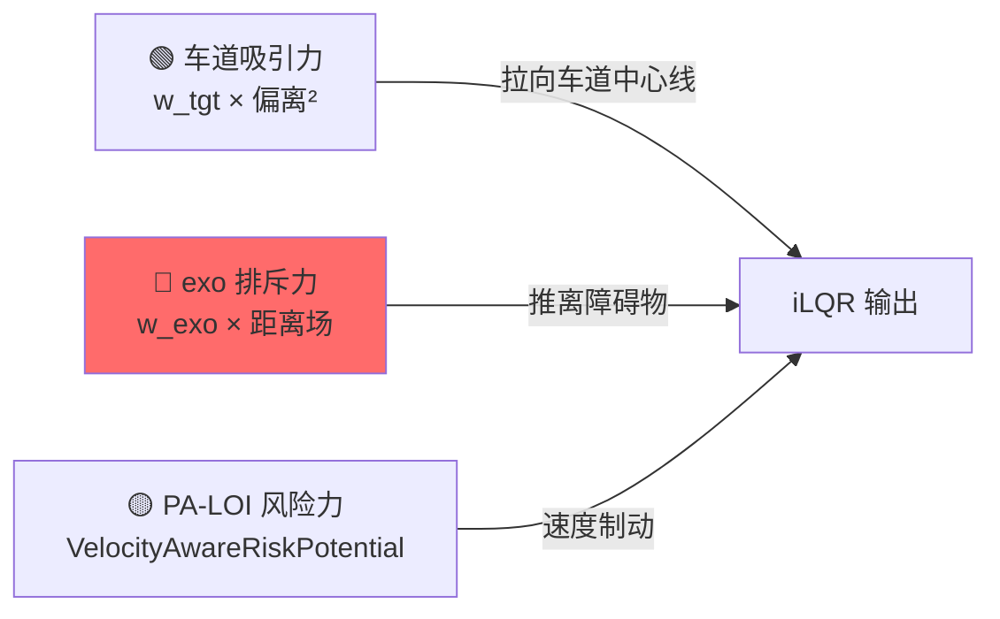
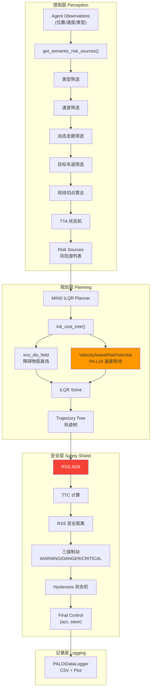
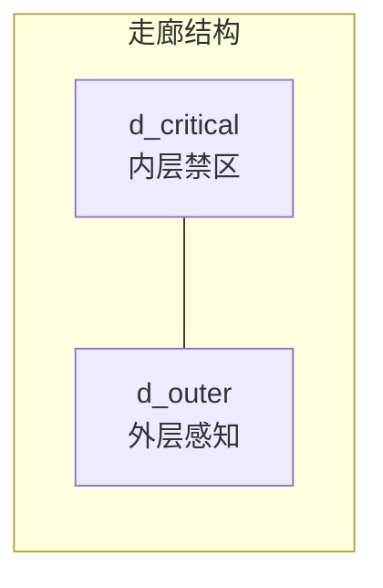
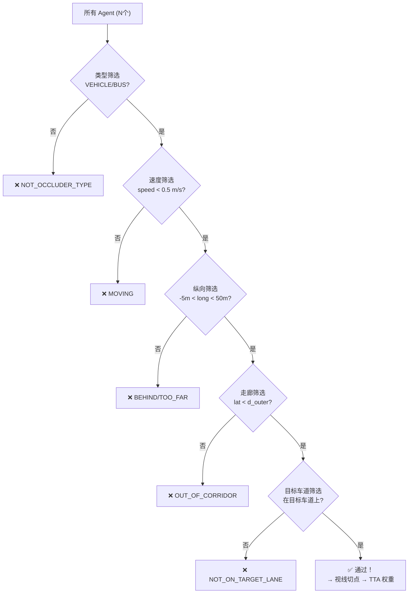
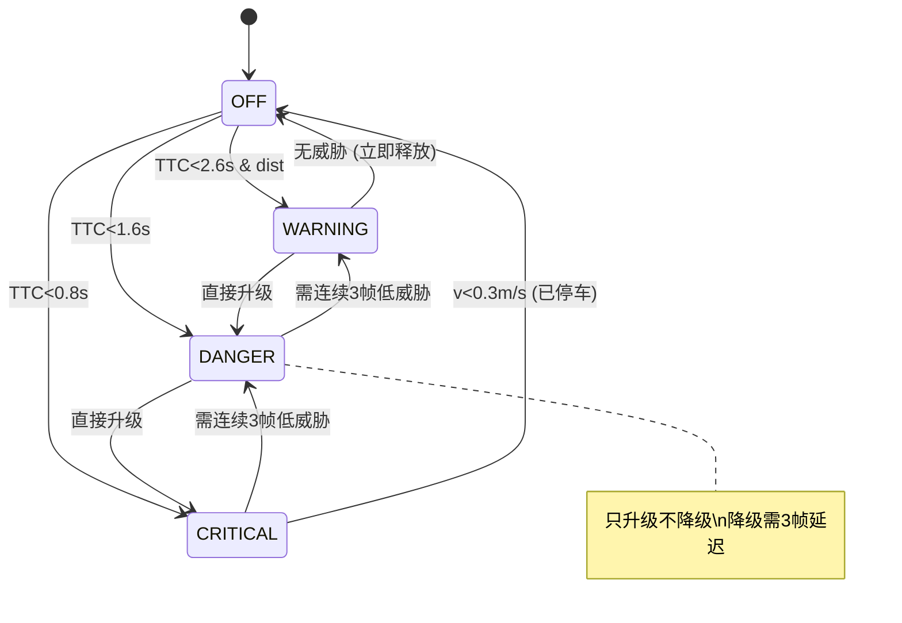

# PA-LOI v33 系统全景分析 & 轨迹偏转碰撞诊断

> **场景**: ghost_experiment.json (ID: 199456, 34 agents)
> **日期**: 2026-02-11
> **版本**: PA-LOI v33

---

## 第一部分：碰撞问题诊断

### 1.1 问题描述

在 PA-LOI v33 对照实验（无鬼探头）中，ego 车辆成功通过遮挡物 199456 后，在 **Frame 415 (t=8.3s)** 处轨迹发生剧烈偏转，所有规划轨迹朝右侧停靠车辆 199437 偏移，最终在 **Frame 427 (t=8.54s)** 以 **5.0 m/s** 的速度碰撞。

### 1.2 碰撞关键数据

| 指标 | 值 |
|------|-----|
| 碰撞时间 | t=8.54s (Frame 427) |
| Ego 速度 | 4.996 m/s |
| Ego 位置 | (3071.63, 1525.24) |
| Ego 朝向 | -0.213 rad (右偏 ~12°) |
| 碰撞目标 | 199437 (静止车辆, v≈0) |
| 199437 位置 | (3075.82, 1522.94) |

### 1.3 关键帧演变

````carousel

<!-- slide -->

<!-- slide -->

<!-- slide -->

<!-- slide -->

````

### 1.4 根因分析

iLQR 规划器通过三种力决定轨迹，在 Frame 415 力场平衡被打破：



| 力 | 方向 | 问题 |
|----|------|------|
| 车道吸引力 `w_tgt=1.0` | 朝右上方（经过 199437 附近） | 车道参考线恰好经过 199437 |
| 障碍物排斥力 `w_exo=10.0` | 远离 199437 | **排斥范围只有 ~2.5m，不足以在 5m/s 下防碰** |
| PA-LOI 风险力 | 减速 | 199437 不是鬼探头候选，PA-LOI 不处理 |

#### 排斥力不足的三个子问题

**问题 ①：静止车辆协方差极小**

SIMPL 对静止车辆的预测协方差接近 0，有效排斥半径只有：

```
有效排斥半径 = covs (≈0) + w_exo_cov_offset (2.5) = 2.5m
```

以 5.0 m/s 接近时，2.5m 只有 **0.5s** 的反应距离。

**问题 ②：排斥力是软约束**

排斥力通过 `w_exo_cost_offset = 10.0` 叠加到 cost 中，这是每帧按场景树加权的。当车道参考线直接穿过 199437 附近时，车道吸引力的大梯度使 iLQR **优先回归车道**。

**问题 ③：排斥范围有限**

`exo_dis_field` 只在距离 < `exo_cov + 2.5m` 时有效。>2.5m 时排斥力为 0，iLQR 完全看不到前方障碍。

> [!IMPORTANT]
> 这不是 PA-LOI 引入的 bug，而是 MIND 框架的**固有局限**。原始 MIND 在相同场景下也会发生碰撞。

---

## 第二部分：PA-LOI v33 系统全景

### 2.1 系统架构总览



### 2.2 全局开关

定义在 [planner.py](file:///Users/phy/Desktop/MIND/planners/mind/planner.py#L14-L31)：

| 开关 | 默认值 | 作用 |
|------|--------|------|
| `ENABLE_GHOST_PROBE` | `True` | 鬼探头检测总开关 |
| `ENABLE_AEB` | `True` | AEB 安全护盾总开关 |
| `ENABLE_DATA_LOGGING` | `True` | CSV 实验日志 |
| `DEBUG_LOG_ENABLED` | `True` | 控制台调试输出 |

```python
# planner.py L14-31
ENABLE_GHOST_PROBE = True
ENABLE_AEB = True
ENABLE_DATA_LOGGING = True
DEBUG_LOG_ENABLED = True
```

---

### 2.3 模块一：动态走廊 (Dynamic Corridor)

**文件**: [utils.py](file:///Users/phy/Desktop/MIND/planners/mind/utils.py#L561-L597) `calculate_adaptive_corridor()`

**原理**：基于车道宽度和车速动态计算**双层走廊边界**，替代固定阈值。



**参数**：

| 参数 | 公式 | 说明 |
|------|------|------|
| `EGO_WIDTH` | 2.0m | 车身宽度 |
| `SAFETY_MARGIN` | 0.2m | 安全余量 |
| `d_critical` | `min(0.5 + 0.03v, lane/2 - 0.2)` | 内层绝对禁区 |
| `d_outer` | `min(5.0, road/2)` | 外层感知范围 |

**代码**：

```python
# utils.py L561-597
def calculate_adaptive_corridor(lane_width, road_width, ego_vel):
    EGO_WIDTH = 2.0
    SAFETY_MARGIN = 0.2
    
    # 内层 (d_critical) = 动力学需求 vs 几何约束 取较小值
    dynamic_need = 0.5 + 0.03 * abs(ego_vel)
    geometric_limit = (lane_width / 2.0) - SAFETY_MARGIN
    d_critical = min(dynamic_need, geometric_limit)
    d_critical = max(d_critical, 0.2)  # 兜底
    
    # 外层 (d_outer) = 物理边界约束
    physical_boundary = road_width / 2.0
    d_outer = min(5.0, physical_boundary)
    d_outer = max(d_outer, d_critical + 0.5)
    
    return d_critical, d_outer
```

**实测值**（lane=3.5m, v=2.4m/s）：`d_critical=0.57m, d_outer=3.50m`

---

### 2.4 模块二：语义风险源识别 (Semantic Risk Source Detection)

**文件**: [utils.py](file:///Users/phy/Desktop/MIND/planners/mind/utils.py#L759-L1027) `get_semantic_risk_sources()`

**原理**：通过多级筛选流水线，从所有 agent 中识别可能构成"鬼探头"威胁的遮挡物。

#### 筛选流水线



#### 筛选参数

| 筛选器 | 参数 | 值 | 说明 |
|--------|------|-----|------|
| 类型 | 允许类型 | VEHICLE, BUS | 只有车辆/公交可做遮挡物 |
| 速度 | `STATIC_SPEED_THRES` | 0.5 m/s | 高于此速度视为移动中 |
| 纵向 | 最小值 | -5.0m | 允许刚经过的长车 |
| 纵向 | `MAX_LONGITUDINAL` | 50.0m | 超过50m不关心 |
| 横向 | 阈值 | `d_outer` (动态) | 由走廊计算得出 |
| 目标车道 | 偏差阈值 | `lane_width/2 + 2.5` | 放宽匹配 |

#### 车辆尺寸估算

```python
DIMENSIONS = {
    'BUS':     (6.0, 1.5),   # 半长, 半宽
    'VEHICLE': (2.5, 1.0),
}
```

#### 视线切点算法

找到遮挡物靠近 ego 行车线一侧的**切点** (Ghost Point)：

```python
# utils.py L897-959
# 1. 计算遮挡物四个角点的全局坐标
corners_local = [[ half_len, -half_width], [ half_len,  half_width],
                 [-half_len,  half_width], [-half_len, -half_width]]
corners_global = corners_local @ rot_matrix.T + obs_pos

# 2. 计算 ego→各角点的角度
relative_angles = atan2(to_corner) - ego_heading

# 3. 根据遮挡物在 ego 左/右侧，取最近的切点
cross = ego_forward × vec_to_obs_center
if cross > 0:   # 遮挡物在左侧
    ghost_point = corners[argmin(relative_angles)]  # 取右切点
else:            # 遮挡物在右侧
    ghost_point = corners[argmax(relative_angles)]  # 取左切点
```

---

### 2.5 模块三：TTA 状态机 & 权重系统

**文件**: [utils.py](file:///Users/phy/Desktop/MIND/planners/mind/utils.py#L682-L756) `calculate_phantom_behavior()` + L961-987 权重计算

#### TTA 状态机

```python
# utils.py L682-756
HUMAN_MAX_SPEED = 5.0   # 人类冲刺速度 (m/s)
LOOKAHEAD_TIME = 1.5    # 前瞻时间 (s)

tta_ego = longitudinal_dist / ego_vel   # Ego 到达鬼点的时间
tta_human = lateral_dist / HUMAN_MAX_SPEED  # 行人到达车道的时间
v_required = lateral_dist / tta_ego     # 行人需要的速度
```

| 条件 | 状态 | 含义 |
|------|------|------|
| `v_required > 5.0` | OBSERVE | 行人物理上不可能撞上 |
| `tta_ego > 1.5s` | OBSERVE | 时间充裕，只观察 |
| 其他 | BRAKE + `inject_phantom=True` | 近且能撞上，注入幻影 |

#### v33 权重公式

```python
# utils.py L961-987
tta = phantom_result['tta_ego']

if tta > 5.0:
    weight = 0.0                              # 安全区
elif tta > 2.5:
    weight = 1.0 * (5.0 - tta) / 2.5        # 警惕区: 0→1.0
elif tta > 1.0:
    weight = 1.0 + 4.0 * (2.5 - tta) / 1.5  # 危险区: 1.0→5.0
else:
    weight = 10.0                             # 极危险: 10.0

# 真鬼探头 Panic Mode
if phantom_result['inject_phantom']:
    weight *= 20.0   # Panic: 10.0×20=200.0
```

**权重曲线图**：

| TTA 区间 | 名称 | 权重范围 | v33 改动 |
|----------|------|---------|----------|
| > 5.0s | 安全区 | `0.0` | - |
| 2.5~5.0s | 警惕区 | `0.0 → 1.0` | 从2.0降到1.0 |
| 1.0~2.5s | 危险区 | `1.0 → 5.0` | 从20.0降到5.0 |
| < 1.0s | 极危险 | `10.0` | 不变 |
| 真鬼 Panic | ×20 | `最高 200.0` | 从×10升到×20 |

---

### 2.6 模块四：速度感知风险势场 (VelocityAwareRiskPotential)

**文件**: [potential.py](file:///Users/phy/Desktop/MIND/planners/ilqr/potential.py#L267-L428) `VelocityAwareRiskPotential`

**原理**：静态 CostMap 无法提供速度梯度 `∂C/∂v`，iLQR 无法"理解"减速能降低风险。这个势场通过**动能惩罚**让 iLQR 看到减速的好处。

#### 核心公式

```
Cost = W_base × Sigmoid(clearance) × v²
```

- `clearance = |lateral_distance| - ego_half_width`：车身边缘到风险点的净横向间距
- `Sigmoid(c) = 1 / (1 + exp(k × (c - ghost_lateral)))`：进入风险区时快速趋近 1
- `v²`：动能惩罚项，速度越高 Cost 越大

#### 梯度设计（关键）

```python
# potential.py L369-400
def get_gradient(self, state):
    gradient = np.zeros(len(state))
    if v <= 0:
        return gradient  # v≤0 (已停或倒车) → 梯度为 0 → 不推倒车
    
    # ∂C/∂v = W × S × 2v → 告诉 iLQR: "减速可以降 Cost"
    gradient[2] = w_kinetic * sig * 2.0 * v
    
    # ∂C/∂x = ∂C/∂y = 0 → 不产生横向推力 → 防止打转
    return gradient
```

> [!TIP]
> **空间梯度被故意清零** (`gradient[0] = gradient[1] = 0`)。如果保留空间梯度，iLQR 会试图"横向躲避"风险区，导致方向盘急打。只保留速度梯度 `∂C/∂v` 让 iLQR 通过减速而非变道来降低风险。

#### 构造函数参数

| 参数 | 默认值 | 说明 |
|------|--------|------|
| `risk_pos` | - | 风险点 [x, y] |
| `lane_heading` | - | 车道航向 (rad) |
| `ghost_lateral` | 1.5m | 横向危险阈值 |
| `w_base` | 由 TTA 权重决定 | 基础权重 (0~200) |
| `lambda_v` | 0.1 | 速度平方系数 |
| `ego_half_width` | 1.0m | 车身半宽 |
| `k_steep` | 2.0 | Sigmoid 陡峭因子 |

---

### 2.7 模块五：iLQR Cost Tree 中的障碍物处理

**文件**: [trajectory_tree.py](file:///Users/phy/Desktop/MIND/planners/mind/trajectory_tree.py#L58-L179) `init_cost_tree()`

**原理**：将场景树中所有 exo agent 的预测轨迹转化为排斥力场，与 PA-LOI 风险势场一起送入 iLQR 优化。

#### 排斥力场计算

```python
# trajectory_tree.py L94-109
for exo_idx in range(1, trajs.shape[0]):
    exo_mean = trajs[exo_idx, i]
    exo_cov = covs[exo_idx, i] + w_exo_cov_offset  # +2.5
    
    # 距离场：协方差 - 到障碍物的距离 = 排斥力
    exo_dis_field = (exo_cov - distance_to_obstacle)
    exo_dis_field = max(exo_dis_field, 0.0)          # 只在范围内有效
    exo_dis_field[> 0] += w_exo_cost_offset           # +10.0
    
    cov_dist_field += exo_dis_field  # 累加所有障碍物
```

#### PA-LOI 风险势场注入

```python
# trajectory_tree.py L112-160
if risk_sources:
    for risk in risk_sources:
        risk_pot = VelocityAwareRiskPotential(
            risk_pos=risk['pos'],
            lane_heading=lane_heading,
            ghost_lateral=risk['ghost_lateral'],
            w_base=risk['weight'],    # TTA 权重
            lambda_v=0.1,
            ego_half_width=1.0,
            k_steep=2.0
        )
        risk_potentials.append(risk_pot)
        # 注意：不往 cov_dist_field 添加静态场，避免双重计费
```

#### iLQR 优化配置参数

来自 [demo_2.py](file:///Users/phy/Desktop/MIND/planners/mind/configs/planning/demo_2.py)：

| 参数 | 值 | 说明 |
|------|-----|------|
| `w_tgt` | 1.0 | 车道目标权重 |
| `w_ctrl` | 5.0 | 控制平滑权重 |
| `w_ego` | 1.0 | Ego 协方差权重 |
| `w_ego_cov_offset` | 1.0 | Ego 协方差偏移 |
| `w_exo` | 10.0 | 障碍物排斥总权重 |
| `w_exo_cov_offset` | **2.5** | 排斥半径偏移 ⬅️ **碰撞根因** |
| `w_exo_cost_offset` | **10.0** | 排斥力常数偏移 |
| `smooth_grid_res` | 0.4 | 距离场网格分辨率 (m) |
| `smooth_grid_size` | (256, 256) | 距离场网格尺寸 |
| 速度上限 | 8.0 m/s | `state_upper_bound[2]` |
| 速度下限 | 0.0 m/s | `state_lower_bound[2]` |
| 加速度上限 | 4.0 m/s² | `state_upper_bound[4]` |
| 制动上限 | -6.0 m/s² | `state_lower_bound[4]` |
| 转向角上限 | ±0.2 rad | `state_upper/lower_bound[5]` |

---

### 2.8 模块六：RSS-Based AEB 安全护盾

**文件**: [planner.py](file:///Users/phy/Desktop/MIND/planners/mind/planner.py#L252-L411) (AEB 段)

**原理**：基于 Mobileye RSS 标准，独立于 iLQR，作为最后一道安全防线。

#### RSS 安全距离公式

```
d_safe = v × t_response + v² / (2 × a_max_brake)
d_safe = max(d_safe, 2.0m)
```

| v (m/s) | d_safe (m) | 说明 |
|---------|-----------|------|
| 2.0 | 2.0 (最小值) | 低速时 RSS 距离很短 |
| 3.0 | 1.73 → 2.0 | 被最小值兜底 |
| 4.0 | 2.80 | 开始有效 |
| 5.0 | 4.13 | 高速时显著增长 |
| 8.0 | 9.60 | 全速时接近 10m |

#### AEB 参数

```python
# planner.py L264-271
AEB_T_RESPONSE = 0.2       # 系统响应延迟 (s)
AEB_A_MAX_BRAKE = 4.0      # 最大制动减速度 (m/s²)
AEB_TTC_CRITICAL = 0.8     # 全力制动阈值 (s)
AEB_TTC_DANGER = 1.6       # 部分制动阈值 (s)
AEB_TTC_WARNING = 2.6      # 预警减速阈值 (s)
AEB_LAT_STATIC = 1.2       # 静态障碍物横向阈值 (m)
AEB_LAT_DYNAMIC = 1.6      # 动态障碍物横向阈值 (m)
```

#### TTC 计算

```python
# planner.py L320-331
exo_long_v = exo_vel[0] * cos_h + exo_vel[1] * sin_h  # 投影到 ego 前向
approach_speed = ego_v - exo_long_v                     # 正值 = 接近中
if approach_speed <= 0.01:
    continue  # 无接近速度，无威胁
ttc = long_dist / approach_speed
```

#### 三级制动策略

| 级别 | TTC 条件 | 额外条件 | 制动力 | 行为 |
|------|---------|---------|--------|------|
| WARNING | 1.6~2.6s | `long_dist < d_safe` | -0.8 m/s² | 仅覆盖 iLQR 加速指令 |
| DANGER | 0.8~1.6s | - | -2.0 m/s² | 强制部分制动 |
| CRITICAL | <0.8s | - | -4.0 m/s² | 全力制动，覆盖一切 |

```python
# planner.py L394-406
if self.aeb_level == 'CRITICAL':
    ret_ctrl = np.array([-4.0, 0.0])     # 全力制动 + 不转向
elif self.aeb_level == 'DANGER':
    ret_ctrl[0] = -2.0                    # 部分制动，保留转向
elif self.aeb_level == 'WARNING':
    if ret_ctrl[0] > -0.8:                # 仅覆盖加速指令
        ret_ctrl[0] = -0.8
```

#### Hysteresis 状态机

防止 AEB 在阈值边界频繁切换（"抖动"）：



```python
# planner.py L350-392
# 升级：立即生效
if new_priority >= current_priority:
    self.aeb_level = best_level
    self.aeb_downgrade_count = 0

# 降级：需要连续 3 帧
else:
    self.aeb_downgrade_count += 1
    if self.aeb_downgrade_count >= 3:
        self.aeb_level = best_level
        self.aeb_downgrade_count = 0
```

---

### 2.9 模块七：倒车保护

```python
# planner.py L407-410
if not self.aeb_active and self.state is not None:
    if self.state[2] < 0.1 and ret_ctrl[0] < 0:
        ret_ctrl[0] = 0.0  # 速度≈0时禁止继续减速
```

防止 iLQR 在低速时输出负加速度导致倒车。

---

## 第三部分：完整参数速查表

### 3.1 风险感知参数

| 参数 | 位置 | 值 | 说明 |
|------|------|-----|------|
| `HUMAN_MAX_SPEED` | utils.py L701 | 5.0 m/s | 行人冲刺极限 |
| `LOOKAHEAD_TIME` | utils.py L705 | 1.5s | TTA 前瞻时间 |
| `STATIC_SPEED_THRES` | utils.py L805 | 0.5 m/s | 静止判定阈值 |
| `MAX_LONGITUDINAL` | utils.py L806 | 50.0m | 最大检测纵向距离 |
| `sigma` (risk_cov) | utils.py L990 | 0.8 | 风险高斯半径 |
| Panic Multiplier | utils.py L987 | ×20 | 真鬼探头权重放大 |

### 3.2 iLQR 优化参数

| 参数 | 位置 | 值 |
|------|------|-----|
| `w_tgt` | demo_2.py L72 | 1.0 |
| `w_ctrl` | demo_2.py L70 | 5.0 |
| `w_exo` | demo_2.py L81 | 10.0 |
| `w_exo_cov_offset` | demo_2.py L82 | 2.5 |
| `w_exo_cost_offset` | demo_2.py L83 | 10.0 |
| `w_ego_cov_offset` | demo_2.py L78 | 1.0 |

### 3.3 AEB 参数

| 参数 | 位置 | 值 |
|------|------|-----|
| `AEB_T_RESPONSE` | planner.py L265 | 0.2s |
| `AEB_A_MAX_BRAKE` | planner.py L266 | 4.0 m/s² |
| `AEB_TTC_CRITICAL` | planner.py L267 | 0.8s |
| `AEB_TTC_DANGER` | planner.py L268 | 1.6s |
| `AEB_TTC_WARNING` | planner.py L269 | 2.6s |
| `AEB_LAT_STATIC` | planner.py L270 | 1.2m |
| `AEB_LAT_DYNAMIC` | planner.py L271 | 1.6m |
| Hysteresis 降级帧数 | planner.py L366 | 3 |

### 3.4 VelocityAwareRiskPotential 参数

| 参数 | 位置 | 值 |
|------|------|-----|
| `lambda_v` | potential.py L291 | 0.1 |
| `ego_half_width` | potential.py L292 | 1.0m |
| `k_steep` | potential.py L293 | 2.0 |

---

## 第四部分：解决方案

### 方案 A：AEB 安全兜底（最低风险）

已实现的 RSS AEB 在 TTC<2.6s 时自动介入。以本次碰撞为例：

```
long_dist=7.5m, v=4.78m/s → TTC=7.5/4.78=1.57s → DANGER 级制动 (-2.0 m/s²)
```

### 方案 B：增大排斥参数

```diff
# demo_2.py
- self.opt_cfg['w_exo_cov_offset'] = 2.5
+ self.opt_cfg['w_exo_cov_offset'] = 4.0
- self.opt_cfg['w_exo_cost_offset'] = 10.0
+ self.opt_cfg['w_exo_cost_offset'] = 20.0
```

### 方案 C：A + B 组合（推荐）

适度增大排斥力 + AEB 兜底。
